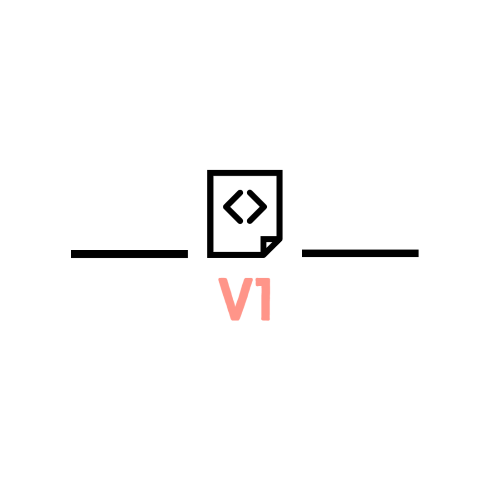

<!--
*** Thanks for checking out the Best-README-Template. If you have a suggestion
*** that would make this better, please fork the repo and create a pull request
*** or simply open an issue with the tag "enhancement".
*** Don't forget to give the project a star!
*** Thanks again! Now go create something AMAZING! :D
-->

<!-- PROJECT SHIELDS -->
<!--
*** I'm using markdown "reference style" links for readability.
*** Reference links are enclosed in brackets [ ] instead of parentheses ( ).
*** See the bottom of this document for the declaration of the reference variables
*** for contributors-url, forks-url, etc. This is an optional, concise syntax you may use.
*** https://www.markdownguide.org/basic-syntax/#reference-style-links
-->
[![Contributors][contributors-shield]][contributors-url]
[![Forks][forks-shield]][forks-url]
[![Stargazers][stars-shield]][stars-url]
[![Issues][issues-shield]][issues-url]
[![MIT License][license-shield]][license-url]
[![LinkedIn][linkedin-shield]][linkedin-url]

<!-- PROJECT LOGO -->

  

<h3 align="center">V1/ HotBot_</h3>

  

    this project is a site underdevelopment to help me get started learning html, css, javascript.
     
    <a href="https://github.com/Hao14/WebDesign"><strong>Explore the docs »</strong></a>
     
     
    <a href="https://github.com/Hao14/WebDesign">View Demo</a>
    ·
    <a href="https://github.com/Hao14/WebDesign/issues">Report Bug</a>
    ·
    <a href="https://github.com/Hao14/WebDesign/issues">Request Feature</a>
  

<!-- TABLE OF CONTENTS -->

  
Table of Contents

  <ol>
    <li>
      <a href="#about-the-project">About The Project</a>
      <ul>
        <li><a href="#built-with">Built With</a></li>
      </ul>
    </li>
    <li>
      <a href="#getting-started">Getting Started</a>
      <ul>
        <li><a href="#prerequisites">Prerequisites</a></li>
        <li><a href="#installation">Installation</a></li>
      </ul>
    </li>
    <li><a href="#usage">Usage</a></li>
    <li><a href="#roadmap">Roadmap</a></li>
    <li><a href="#contributing">Contributing</a></li>
    <li><a href="#license">License</a></li>
    <li><a href="#contact">Contact</a></li>
    <li><a href="#acknowledgments">Acknowledgments</a></li>
  </ol>

<!-- ABOUT THE PROJECT -->
## About The Project

[![Product Name Screen Shot][product-screenshot]](https://www.johnishot.online)

<h4 align="center">Undergoing to become a full Website.</h4>

(<a href="#top">back to top</a>)

### Built With

* [React.js](https://reactjs.org/)

(<a href="#top">back to top</a>)

<!-- GETTING STARTED -->
## Discord
[JoinDiscord](https://discord.com/invite/48vbdXY9cp) - 陈英豪-Hao™#7801

<!-- USAGE EXAMPLES -->
## Usage

For info for how to use Dynmap visit the doc bellow.
[Documentation](https://www.johnishot.online)

(<a href="#top">back to top</a>)

<!-- ROADMAP -->
## Roadmap

- [x] Pages
    - [ ] Home
    - [ ] About
    - [ ] Invites
    - [ ] Contact
- [ ] Dynmap
- [ ] Issues

See the [open issues](https://github.com/Hao14/WebDesign/issues) for a full list of proposed features (and known issues).

(<a href="#top">back to top</a>)

<!-- CONTRIBUTING -->
## Contributing

(<a href="#top">back to top</a>)

<!-- LICENSE -->
## License

Distributed under the MIT License. See `LICENSE.txt` for more information.

(<a href="#top">back to top</a>)

<!-- CONTACT -->
## Contact

Info - [@nah.hao](http://www.instagram.com/nah.hao) - jaysanasasin@gmail.com

Project Link: [https://github.com/Hao14/WebDesign](https://github.com/Hao14/WebDesign)

(<a href="#top">back to top</a>)

<!-- ACKNOWLEDGMENTS -->
## Acknowledgments

* [GitHub Emoji Cheat Sheet](https://www.webpagefx.com/tools/emoji-cheat-sheet)
* 

(<a href="#top">back to top</a>)

<!-- MARKDOWN LINKS & IMAGES -->
<!-- https://www.markdownguide.org/basic-syntax/#reference-style-links -->
[contributors-shield]: https://img.shields.io/github/contributors/Hao14/WebDesign.svg?style=for-the-badge
[contributors-url]: https://github.com/Hao14/WebDesign/graphs/contributors
[forks-shield]: https://img.shields.io/github/forks/Hao14/WebDesign.svg?style=for-the-badge
[forks-url]: https://github.com/Hao14/WebDesign/network/members
[stars-shield]: https://img.shields.io/github/stars/Hao14/WebDesign.svg?style=for-the-badge
[stars-url]: https://github.com/Hao14/WebDesign/stargazers
[issues-shield]: https://img.shields.io/github/issues/Hao14/WebDesign.svg?style=for-the-badge
[issues-url]: https://github.com/Hao14/WebDesign/issues
[license-shield]: https://img.shields.io/github/license/Hao14/WebDesign.svg?style=for-the-badge
[license-url]: https://github.com/Hao14/WebDesign/blob/main/LICENSE.txt
[linkedin-shield]: https://img.shields.io/badge/-LinkedIn-black.svg?style=for-the-badge&logo=linkedin&colorB=555
[linkedin-url]: https://linkedin.com/in/linkedin_username
[product-screenshot]: assets/pbg1.png
